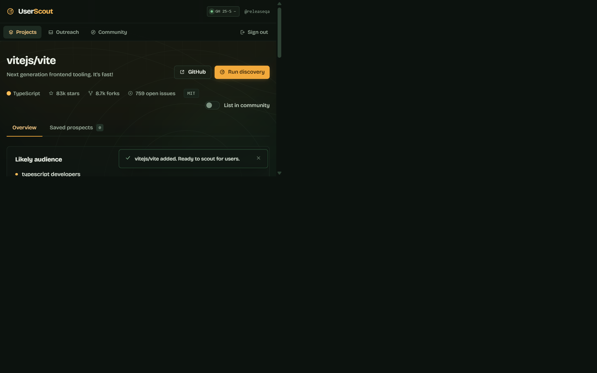
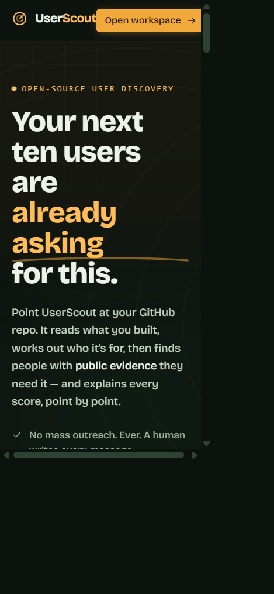

# UserScout

> Find people who actually need what you built.

UserScout helps developers discover potentially relevant users for open-source projects using public GitHub activity and transparent evidence. It turns a repository into a shortlist of people to understand, not a list of people to spam.


## Why UserScout?

Building a project is only half the work. Finding people who genuinely care about it is difficult.

UserScout helps you research potential users from observable public signals instead of guessing. Every result explains why it surfaced, links to the public evidence, and leaves the outreach decision with you.

## How it works

1. Add your GitHub project.
2. Review the project analysis.
3. Discover potentially relevant people.
4. Review the public evidence.
5. Save prospects.
6. Reach out personally.
7. Track replies, trials, feedback, and conversions.

## What makes UserScout different?

- **Evidence over guesses:** recommendations are tied to public GitHub activity.
- **Quality over quantity:** weak context cannot masquerade as intent.
- **Transparent scoring:** every relevance score has a visible breakdown.
- **Human-controlled outreach:** UserScout never sends messages for you.
- **Public-data first:** private information is not scraped or modeled.
- **Open source:** the project is MIT licensed and its core logic is testable.

## Screenshots

### Find relevant people

Discovery presents multiple candidates efficiently, with a score, confidence, source, explanation, and expandable evidence.


### Understand why they are relevant

The prospect view connects the score to public evidence and gives you a private, manual workspace for notes and drafts.


### Manage the relationship

The outreach workspace tracks your real pipeline from saved prospect to feedback and user, with no automated campaigns.


### Your workspace

Projects, analysis, and conversion metrics stay grounded in your own records.







Screenshots were captured from the running application. Populated discovery screenshots use public data from the `vitejs/vite` repository; the displayed prospect is a real public GitHub result, not fabricated product activity.

## Features

- Public GitHub repository validation and analysis.
- Deterministic keywords, problem space, audience, and query terms.
- Evidence-backed discovery through issues, related repositories, and contributors.
- Relevance scores with signal and confidence breakdowns.
- Saved prospects with public source links.
- Manual outreach drafts, private notes, and status timeline.
- Feedback capture and a record-based conversion funnel.
- Optional local community index for opted-in project metadata.
- Static-host-friendly hash routing.

## How scoring works

The score is not a prediction that someone will become a user. It is a transparent relevance signal based on observable public evidence.

| Signal | Maximum | What it means |
| --- | ---: | --- |
| Problem evidence | 30 | Publicly asks about or discusses the problem. |
| Related project | 25 | Maintains a repository matching the project vocabulary. |
| Related contributions | 15 | Contributes to closely related repositories. |
| Technology match | 20 | Shares language or topic context. |
| Recent activity | 15 | Relevant activity is recent. |
| Audience alignment | 8 | Public bio or topics align with the derived audience. |

Signals are capped at 100. Weak context signals cannot exceed 43 without a strong signal, so “uses the same language” is never presented as proof of need. Confidence is labeled high, medium, or low and can be checked against the breakdown.

## Privacy and anti-spam principles

UserScout is research and organization software, not an outreach automation tool. It:

- does not send messages automatically;
- does not run bulk outreach or follow-up sequences;
- does not scrape private information or bypass authentication;
- does not sell personal information;
- keeps notes, drafts, and outreach history local in this build;
- leaves every message and contact decision under human control.

## Tech stack

- React 18 and TypeScript
- Vite and Tailwind CSS
- React Router hash routing
- GitHub REST API for public repository and activity data
- Web Crypto API for local password hashing and IDs
- Vitest for core regression tests
- Browser `localStorage` through a replaceable storage adapter

## Architecture

The application is organized into a framework-independent core, a reactive state layer, and a React UI. GitHub data flows through an interface into analysis and discovery; services enforce ownership before private records are read or changed.

See [docs/architecture.md](docs/architecture.md) for the data flow, boundaries, security model, and production deployment notes.

## Local development

Requirements: Node.js 20 or newer.

```bash
npm install
npm run dev
npm run test
npm run typecheck
npm run build
```

Open the local URL printed by Vite. Create a workspace account, add a public repository, and run discovery. GitHub requests in this static build are unauthenticated; do not put tokens in `VITE_*` variables because Vite embeds them in the browser bundle.

## Limitations

- Accounts and CRM records are stored in browser `localStorage` on one device.
- Local authentication demonstrates the ownership model but is not a server security boundary.
- Unauthenticated GitHub rate limits can constrain discovery runs.
- There is no backend API, OAuth provider, or server database in this repository.
- True multi-user production deployment requires server-side sessions, a database-backed storage adapter, and a server-side GitHub proxy.

## Roadmap

- [x] Public repository analysis and evidence-backed discovery
- [x] Transparent scoring and manual outreach tracking
- [x] Local-first persistence and focused core tests
- [ ] Server-backed persistence
- [ ] Production OAuth
- [ ] Authenticated GitHub API proxy
- [ ] Multi-device workspaces
- [ ] Additional discovery sources
- [ ] Data export

## Contributing

Read [CONTRIBUTING.md](CONTRIBUTING.md) before opening a pull request. Contributions should preserve evidence-based discovery, human-controlled outreach, accessible UI, and ownership checks.

## License

MIT. See [LICENSE](LICENSE).
