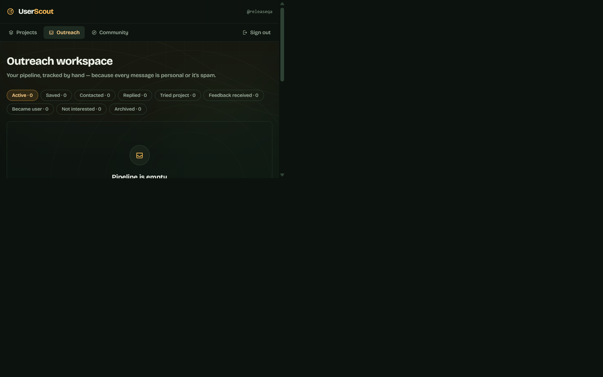
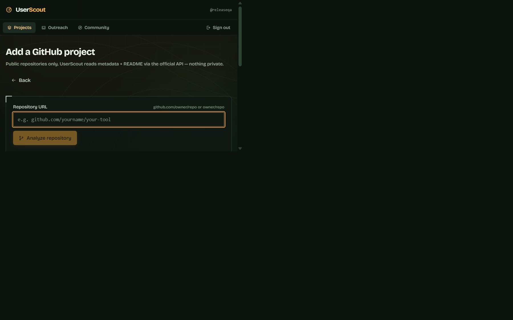

# UserScout

> **Find people who actually need what you built.**

UserScout is an open-source user-discovery platform for developers who build open-source
projects but struggle to find real users and meaningful feedback. Point it at a public
GitHub repository and it will:

1. **Analyze** the project via the official GitHub API (metadata, topics, README, languages).
2. **Derive** the likely problem space, target audience, and search vocabulary — deterministically.
3. **Discover** people with *public evidence* of needing the project (open issues asking about the
   problem, related repos they maintain, related projects they contribute to).
4. **Score** each prospect 0–100 with a transparent, deterministic, testable model.
5. **Explain** every score: signal breakdown + links to the exact public activity behind it.
6. Track the human part: **save → personally contact → reply → trial → feedback → user**,
   with private notes, a manual outreach workspace, and a conversion funnel computed from
   your own records only.

**Philosophy: QUALITY > QUANTITY.** UserScout refuses to be a spam platform. See [Hard limits](#hard-limits-what-userscout-will-not-do).

## Screenshots

These captures show the real product UI and empty states; no sample users, prospects, or
conversion numbers are fabricated.






## How it works

1. Add a public GitHub project.
2. Review the deterministic project analysis.
3. Run discovery against public GitHub activity.
4. Inspect the evidence and relevance score.
5. Save prospects and write personal outreach yourself.
6. Track replies, trials, feedback, and conversions.

## Tech stack

- React 18 and TypeScript
- Vite with Tailwind CSS
- React Router hash routing for static hosting
- GitHub REST API for public repository and activity data
- Browser `localStorage` for this local-first build

---

## Quick start

```bash
npm install
npm run dev                 # http://localhost:5173
npm run build               # production build → dist/
npm run typecheck           # strict TypeScript check
```

The static client uses unauthenticated public GitHub API requests. For authenticated production
use, add a server-side proxy; never put a GitHub token in a `VITE_*` variable because Vite embeds
it in the browser bundle.

Create a workspace account (stored locally, PBKDF2-hashed), add your repo, run discovery,
save prospects, and work them through the outreach pipeline.

## Architecture

```
src/
├── core/                    # framework-free business logic (unit-testable)
│   ├── types.ts             # domain model
│   ├── utils.ts             # crypto (PBKDF2), ids, time, errors
│   ├── storage.ts           # StorageAdapter interface + localStorage impl
│   ├── github.ts            # GitHub API client, URL validation, rate limits
│   ├── analysis.ts          # repo → ProjectProfile (keywords/audience/query terms)
│   ├── discovery.ts         # evidence-gathering engine (issues/repos/contributors)
│   ├── scoring.ts           # deterministic, documented scoring model
│   └── services.ts          # auth/projects/prospects/outreach/feedback + ownership guards
├── state/store.tsx          # reactive workspace state over services
├── components/              # icons (hand-drawn SVG), ui primitives, domain widgets, shell
└── pages/                   # Landing, Auth, Dashboard, ProjectNew, ProjectDetail,
                             # Discovery, ProspectDetail, Outreach, Community
```

**Layering rules**

- Business logic lives in `core/` — never in route handlers or components.
- All persistence goes through `StorageAdapter`. The bundled `LocalStorageAdapter` makes this a
  local-first build (everything stays in your browser). Swap in a server-backed adapter
  (PostgreSQL behind an API) without touching services or UI — that's the production path.
- External integrations sit behind interfaces (`GitHubClient`) so the transport is replaceable.

**Data flow:** `GitHub API → analysis → discovery candidates → scoreCandidate → saveResults →
prospects → outreach events / feedback → computeFunnel`.

## Scoring model (deterministic & documented)

| Signal | Max | Rule |
|---|---|---|
| Problem evidence | 30 | Publicly asked for / discussed the exact problem (issue title/body). Question-shaped: 30 · discussion: 20 |
| Related project | 25 | Maintains a repo matching the project's query terms. 15 base + 5 per matched term (max +10) |
| Contributes to related repos | 15 | Recent commits in closely related repos. 12 base, +3 for 2+ repos |
| Technology match | 20 | Language match +8 · topic/keyword overlap +4 each (max +12). *Weak* |
| Recent activity | 15 | ≤30d: 15 · ≤90d: 10 · ≤180d: 6 · ≤1y: 3. *Weak* |
| Audience alignment | 8 | Bio/topics align with derived audience. *Weak* |

- Signals sum, capped at 100.
- **Confidence:** HIGH = score ≥ 70 *and* a strong signal ≥ 20 pts · MEDIUM = score ≥ 45 or any
  strong signal · else LOW.
- **Weak signals alone can never exceed 43/100.** "Uses Python" is context, not intent — a
  weak-only candidate is always a LOW-confidence cold lead.
- Same evidence in → same score out. No randomness, no black box. The model is implemented in
  `src/core/scoring.ts` as pure functions, ready for property-based unit tests.

## GitHub integration & security

- **Official API only**, over HTTPS, fixed host `api.github.com`.
- **SSRF-safe by construction:** repo input is validated against `github.com` with a strict
  allow-list regex (`parseRepoInput` in `src/core/github.ts`); only the extracted `owner/repo`
  is ever interpolated into request paths. Ports, credentials in URLs, and non-GitHub hosts
  are rejected.
- **No browser GitHub secrets.** This static client uses unauthenticated public API requests.
  Authenticated production use requires a server-side proxy; never place a GitHub token in a
  `VITE_*` variable because Vite embeds it in the browser bundle.
- **Failures handled gracefully:** timeouts (9s AbortController), 404 (nonexistent/private repo),
  403/429 rate limits with reset times surfaced in the UI, malformed JSON, network errors.
- **Rate limiting respected on the client side:** discovery paces requests (~700ms apart) and
  uses ≤ ~15 calls per run. The UI shows remaining core/search budget live.
- **Passwords:** PBKDF2-SHA256, 150k iterations, random 16-byte salts. Never plaintext.
- **Authorization:** every service call verifies `resource.ownerId === actorId` (IDOR
  protection). Private notes, drafts, outreach history and feedback are never exposed
  publicly; the community index shares only already-public repo metadata + username, and
  only when the owner opts in.
- **Input validation** on usernames, passwords, notes (2k), drafts (5k), ratings (1–5).
- No raw HTML injection; React renders all external strings as text.

## Hard limits — what UserScout will NOT do

- ❌ automatic mass emails or bulk messaging
- ❌ automated outreach campaigns / sequences
- ❌ scraping private information or bypassing auth / API restrictions
- ❌ collecting unnecessary personal data (only public GitHub fields are modeled)
- ❌ selling or sharing personal information
- ❌ inventing statistics — funnel metrics are computed from your own rows, or not shown

The human developer writes every message and presses send themselves, from their own
accounts. UserScout provides *context for personalized outreach*, nothing more.

## Environment variables

See [.env.example](.env.example).

| Variable | Required | Purpose |
|---|---|---|
| None | — | Use a server-side proxy for authenticated GitHub requests in production. |

## Testing

The scoring engine, URL validation, and service ownership guards have focused Vitest coverage:

```bash
npm run test
npm run typecheck
npm run build
```

The browser flow is manually smoke-tested against the Vite development server.

## Production deployment

- `npm run build` produces a static bundle (`dist/`) deployable to any static host
  (Netlify, Vercel, GitHub Pages, S3). Use hash routing (already configured) or configure
  SPA rewrites.
- For multi-device / multi-user production use, implement a server-backed
  `StorageAdapter` (PostgreSQL, row-level ownership) behind your API; `core/services.ts`
  is already organized around ownership-guarded operations and needs no changes.
- Add real OAuth (e.g. GitHub OAuth) server-side; the local PBKDF2 accounts in this build
  demonstrate the ownership model but are device-local by design.

### OAuth and database setup

There is no OAuth provider, backend API, or server database in this repository. The included
account flow and `LocalStorageAdapter` are intentionally local demonstrations. For production,
add server-side OAuth/session handling, a server-side GitHub proxy, and a database-backed
`StorageAdapter` with row-level ownership before storing sensitive or multi-device data.

## Known limitations (honest list)

1. **Local-first persistence.** Accounts and CRM data live in `localStorage` on one device.
   Clearing site data clears them. Export-before-clear is a planned feature.
2. **Client-side auth is a demonstration, not a security boundary.** Anyone with device
   access can inspect `localStorage`. Do not treat this build as protecting truly sensitive
   data; wire the server adapter for that.
3. **Unauthenticated GitHub limits** (60 core/h, 10 search/min) throttle heavy discovery use.
  Authenticated production use requires a server-side proxy.
4. **Discovery quality follows repo quality.** Repos with no description/topics yield weak
   query terms and weaker prospects — by design, the engine refuses to guess.
5. Discovery dedupes per project; the same person can appear under two of your projects
   (that's legitimate — different contexts).

## License

MIT — see [LICENSE](LICENSE).
