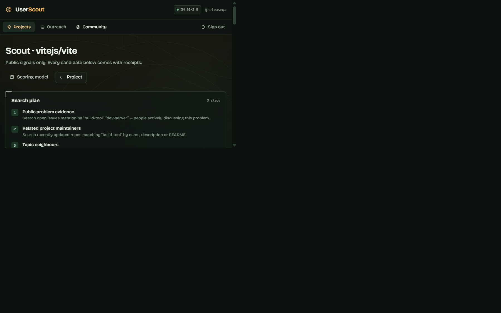
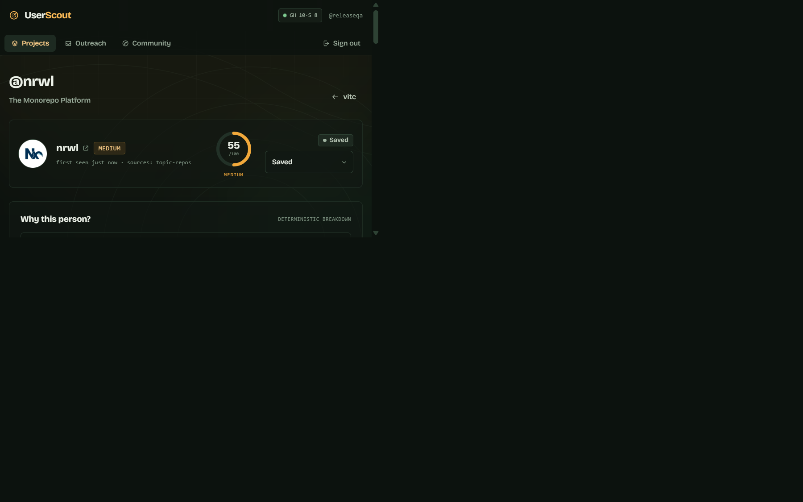
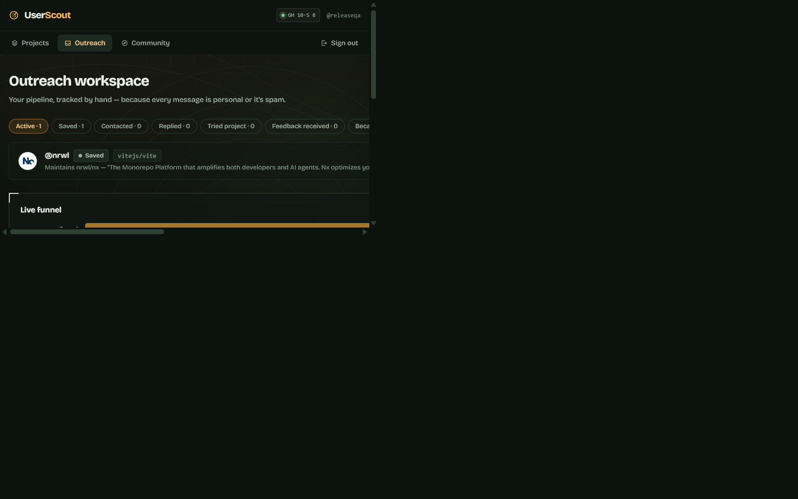

<p align="center">
  
</p>

<h1 align="center">UserScout</h1>

<p align="center"><strong>Find people who actually need what you built.</strong></p>

<p align="center">
  <a href="LICENSE"></a>
  
  
  
</p>

UserScout helps open-source developers discover people who may genuinely need their project using public GitHub evidence, then decide who to contact and track what happens.

<p align="center">
  
</p>

<p align="center"><em>From project → relevant people → evidence → outreach → feedback.</em></p>

## Why UserScout?

Building a project is only half the problem. Finding people who actually need it is often harder.

UserScout moves you from “I built something” to “I found someone with evidence they might need it.” It surfaces public signals, explains each result, and keeps the final decision human.

## How it works

1. Add your GitHub project.
2. Understand the problem and likely audience.
3. Discover public evidence from issues, repositories, and contributions.
4. Review the relevance score and its receipts.
5. Contact people yourself.
6. Track replies, trials, feedback, and conversions.

## What makes UserScout different?

- **Evidence over guessing** — every prospect is tied to public activity.
- **Transparent scoring** — deterministic signals show how relevance was calculated.
- **Quality over quantity** — weak context cannot pretend to be intent.
- **Human-controlled outreach** — drafts and tracking help you; nothing sends automatically.
- **Local-first today** — workspace data stays in the browser in this build.
- **Open source** — MIT licensed, with focused core tests.

## See it in action

### Discover relevant people



Multiple candidates are shown with scores, confidence, sources, explanations, and expandable evidence.

### Understand why someone is relevant



The prospect view connects the score to public evidence and gives you a private place for notes and a personal draft.

### Track outreach and feedback



The manual pipeline records your actual relationship stages without automated campaigns.

### Keep projects in view


The dashboard shows your projects and record-backed progress, including useful empty states for a new workspace.

Screenshots and the demo were captured from the running application. Populated views use public data from `vitejs/vite`; no users, metrics, or activity were fabricated.

## Core features

- GitHub project analysis with derived problem space, audience, and search vocabulary.
- Public evidence discovery through issues, related repositories, and contributors.
- Deterministic relevance scoring with confidence and signal breakdowns.
- Prospect profiles with links to the underlying public activity.
- Saved prospects, private notes, manual outreach drafts, and status timeline.
- Feedback capture and a conversion funnel computed from your records.
- Opt-in local community index for public project metadata.
- Static-host-friendly hash routing.

## How scoring works

The score is not a prediction that someone will become a user. It is a transparent relevance signal based on observable public evidence.

| Signal | Maximum | Meaning |
| --- | ---: | --- |
| Problem evidence | 30 | They publicly ask about or discuss the problem. |
| Related project | 25 | They maintain a repository matching the project vocabulary. |
| Related contributions | 15 | They contribute to closely related repositories. |
| Technology match | 20 | Their language or topics overlap. |
| Recent activity | 15 | Relevant activity is recent. |
| Audience alignment | 8 | Their public bio or topics align with the audience. |

Signals are capped at 100. Weak context alone cannot exceed 43, so using the same language is never treated as proof of need.

## Privacy and responsible discovery

UserScout is research and organization software, not a spam tool. It uses public GitHub information and:

- does not scrape private information or bypass authentication;
- does not send messages automatically or run bulk outreach;
- does not sell personal information;
- keeps notes, drafts, and outreach records in the local workspace today;
- leaves every contact decision and message under human control;
- does not invent activity or statistics.

See [docs/architecture.md](docs/architecture.md) for the technical security model and production path.

## Tech stack

React 18, TypeScript, Vite, Tailwind CSS, React Router, GitHub REST API, Web Crypto, browser `localStorage`, and Vitest.

## Quick start

Requirements: Node.js 20 or newer.

```bash
git clone https://github.com/BistaDinesh03/userscout.git
cd userscout
npm install
npm run dev
```

For verification and production builds:

```bash
npm run test
npm run typecheck
npm run build
```

Open the URL printed by Vite. Create a local workspace, add a public GitHub repository, review its analysis, and run discovery. This static build uses unauthenticated public GitHub requests; never put tokens in `VITE_*` variables because Vite embeds them in the browser bundle.

## Limitations

- Accounts and CRM records are stored in `localStorage` on one device.
- Local authentication demonstrates ownership checks but is not a server security boundary.
- There is no backend API, OAuth provider, or server database in this repository.
- Unauthenticated GitHub rate limits can constrain discovery runs.
- True multi-user production use needs server-side sessions, a database-backed storage adapter, and a server-side GitHub API proxy.

## Roadmap

- [x] Public project analysis and evidence-backed discovery
- [x] Transparent scoring and manual outreach tracking
- [x] Local-first persistence and core tests
- [ ] Server-backed persistence
- [ ] Production OAuth
- [ ] Authenticated GitHub API proxy
- [ ] Multi-device workspaces
- [ ] Additional discovery sources
- [ ] Export functionality

## Contributing

See [CONTRIBUTING.md](CONTRIBUTING.md) for setup, conventions, and the project’s anti-spam principles. Contributions should preserve evidence-based discovery, accessible UI, and ownership checks.

## License

MIT. See [LICENSE](LICENSE).
